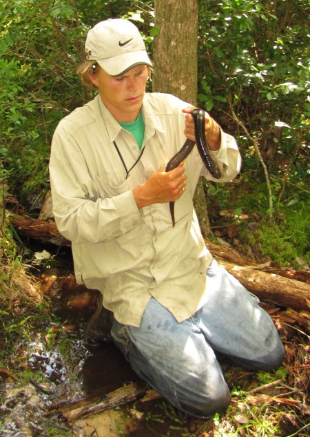
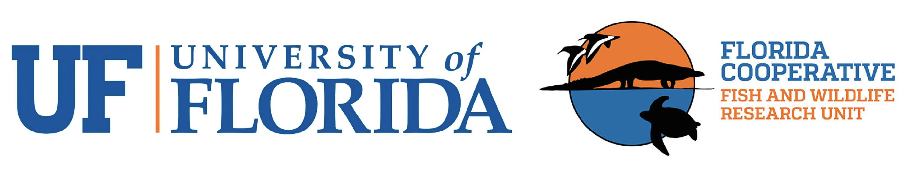

---
---

<link rel="stylesheet" href="styles.css" type="text/css">

# Brian Folt, PhD
# Wildlife Biology, Quantitative Population Ecology, and Decision Analysis

I am a wildlife biologist, quantitative population ecologist, and conservationist who is interested in making smart decisions about natural resource management. I combine field research, quantitative modeling skills, and structured-decision making to understand system dynamics and guide wildlife management in a transparent and inclusive framework. I have a B.S. in [Biological Sciences from Ohio University](https://www.ohio.edu/cas/biology) (2011) and a Ph.D. in [Ecology from Auburn University](http://www.auburn.edu/cosam/departments/biology/) (2017). I am now a post-doctoral researcher in the [Florida Cooperative Fish and Wildlife Research Unit](https://wec.ifas.ufl.edu/coop/) at the University of Florida, where I am working with the U.S. Fish and Wildlife Service to model how gopher tortoises will respond to a changing world. My post-doctoral superviser is [Conor McGowan](https://scholar.google.com/citations?user=8-3_fxYAAAAJ&hl=en&oi=ao).

On this site, you can learn about my [research](https://brianfolt.github.io/research) and [teaching](https://brianfolt.github.io/teaching) background, where I conduct [field research projects](https://brianfolt.github.io/fieldwork), and the resulting [publications](https://brianfolt.github.io/publications). Last, I hope to highlight various other [musings, philosophies, and life experiences](https://brianfolt.github.io/musings) with periodic blog posts.

You can contact me at: brian [dot] folt [at] ufl.edu. My postal address is: 1728 McCarty Drive, Bldg. 810, P.O. Box 110485, Gainesville, Florida 32611-0485, USA

