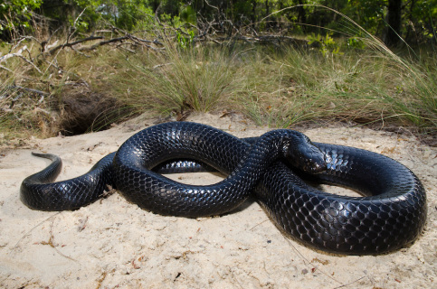

---
---

```{r setup, include=FALSE}
knitr::opts_chunk$set(echo = TRUE)
library(tufte)
```

<link rel="stylesheet" href="styles.css" type="text/css">

<style type="text/css">
body{ /* Normal  */ font-size: 16px; font-family: Arial; color:black}
td {  /* Table  */ font-size: 8px;}
h1.title {font-size: 38px; color: DarkRed;}
h1 { /* Header 1 */ font-size: 28px; color: Black;}
h2 { /* Header 2 */ font-size: 22px; color: Black;}
h3 { /* Header 3 */ font-size: 18px; color: Black;}
code.r{ /* Code block */ font-size: 12px;}
pre { /* Code block - determines code spacing between lines */ font-size: 14px;}
</style>

# Musings 

Below here are a few blogs where I contemplate half-formed philosophies and various other musings about life and this wild world that we live in. Have a click and a read or two.

<div class="expand collapsed" data-toggle="collapse" data-target="#tracks" aria-expanded="false" aria-controls="tracks">
**Tracks and Shadows - 18 June 2020**
</div>

<div class="collapse" id="tracks">


>"<i>Pondering these loose ends - questions answered and some still nagging - I urge young nature-lovers to seek out three sorts of experiences that have pivotally influenced my worldview. The first would be to go backpacking: to feel responsible in your sore, uncertain bones for food, water, shelter, and unforeseen calamities; better yet, at least once, to carry out feces, as we did in Paria Canyon, holding oneself accountable for even personal waste. Another experience would be to walk among Africa's megafauna, thereby getting a firsthand sense of what we've lost in North America, what we stand to lose soon all over the world, forever. And third, I would encourage novice naturalists to slaughter and eat a large mammal - the vegetarian alternative being to clear a chunk of habitat that houses several rabbit-sized fur-bearers, dispatching ever living thing before sundering the ground with a plow and planting fruits, grains, and vegetables. During decades of studying predators I've often wondered what it would be like to face fully the implications of an omnivorous primate lifestyle. But we'll head down that path in the next chapter.</i>"
`r tufte::quote_footer('Harry W. Greene, 2013, <i>Tracks and Shadows: Field Biology as Art</i>')`

I have explored wild places, living off only what I can carry on my back or catch with my hands. I also harvest large mammals and use that meat to provision animal protein in my diet. While I have walked in tropical forests with pumas and jaguars, I hope someday to visit Africa and experience megafauna firsthand. 
</div>

<div class="expand collapsed" data-toggle="collapse" data-target="#missoula" aria-expanded="false" aria-controls="missoula">
**A River Runs Through It - 31 October 2019**
</div>

<div class="collapse" id="missoula">

The Blackfoot River runs through Missoula, Montana, where I visited last week to attend a workshop at the University of Montana. The Blackfoot and its hills struck me as as a phenomenal setting for a college campus. Every day I enjoyed walking across campus, basking in the beautiful fall colors, and watching fly fisherman work the waters in the Blackfoot.

The workshop I participated in was meant to improve my statistical modeling skills. The five-day course taught us the theory, methodology, and interpretation of integrated population models in a Bayesian framework. This relatively new technique is particularly exciting because it integrates multiple datasets on wild animal populations (mark-recapture data [to estimate survival], count data [to estimate trends in abundance], and fecundity data [to estimate recruitment]); by integrating these data, one can project abundance while estimating survival and fecundity patterns driving variation in population size. I’m back in Alabama now, and I am busy putting these new skills to use while modeling population demography and viability for Gopher Tortoises at our study sites in south Alabama!


I’m particularly thankful for Michael Schaub and Marc Kery for traveling all the way from Switzerland to teach the course. Their teaching style is so clear and concise, and I recommend their workshops for anyone interesting in Bayesian analysis. I learned a lot. But perhaps the most valuable lesson I learned was that I will never travel out West without my fly rod. The Blackfoot looked phenomenal, even in October, and I missed out on some prime fly-hurling time. Until the next trip!
</div>

<div class="expand collapsed" data-toggle="collapse" data-target="#indigo" aria-expanded="false" aria-controls="indigo">
**Indigo Snake Reintroductions - 2 April 2019**
</div>

<div class="collapse" id="indigo">

I have been involved in a long-term project to reintroduce Eastern Indigo Snakes into historic areas of the species range where it no longer lives. This is an important project that seeks to decrease extinction risk for the endangered snake, while also restoring its ecological role into fragile ecosystems. I wrote an op-ed article in the Tallahassee Democrat that describes the reintroduction project as a whole, and some of our important research on the topic. You can read it [here](https://www.tallahassee.com/story/opinion/2019/03/31/indigo-snake-releases-guided-strong-science-conservation-ethic/3313120002/).
</div>

<div class="expand collapsed" data-toggle="collapse" data-target="#LSU" aria-expanded="false" aria-controls="LSU">
**Visit to LSU Museum of Natural Sciences - 13 March 2019**
</div>

<div class="collapse" id="LSU">

Last week, I visited the Louisiana State University (LSU) Museum of Natural Sciences, one of the largest natural history collections in the United States. My goal for the trip was to learn about the important research and museum curation activities ongoing at the museum, to get to know the students, faculty, and staff, and to give a seminar to museum staff describing my post-doctoral research.

Oscar Johnson, a PhD student in the Brumfield laboratory, gave me an incredible tour of the Ornithology Collections. Here is Oscar, explaining/demonstrating to me that the “tail” of the Resplendant Quetzal aren’t actually rectrices (tail feathers), but rather upper tail coverts. They include phylogenetic trees inside each cabinet, which I found to be a useful feature. Oscar also showed me the smallest bird in the world, the Bumblebee Hummingbird!


Jackson Roberts, another PhD student, gave me a tour through the Herpetology Collections and molecular genetic laboratories. Jackson showed me tons of interesting specimens, including the smallest and largest frogs in the world, Paedophryne amauensis from New Guinea, and the Goliath Frog (Conraua goliath) from Africa, respectively.

I presented a seminar describing my post-doctoral research on tortoises and eastern indigo snakes. The seminar series at the museum is super cool; they put chairs out among the museum exhibits, it creates a nice and intimate atmosphere. The crowd was super fun and engaging, so I really enjoyed presenting to them. And, afterword there was a beer social on the front steps of the museum. I had a blast and am really fortunate to have been invited down for the experience.

</div>

<div class="expand collapsed" data-toggle="collapse" data-target="#trips" aria-expanded="false" aria-controls="trips">
**Long Trips in Wild Places - 4 July 2018**
</div>

<div class="collapse" id="trips">
I spend time outdoors with friends, family, and colleagues as much as I can. Sometimes this takes the form of an afternoon foray, or a one-night stand in the woods. A quick breath of fresh air and a look at the stars. Every now and again, however, we try to extend these trips as long as we can: for three, four, or five days. Off the grid, sleeping under the stars, and living off the land as much as possible. I find these long trips to be particularly powerful. In many ways, they cause a primal awakening in my form and psyche, something that I find to be humanizing and empowering - a sensation of utter freedom that I can't find anywhere else in my life.

During my summer vacation, I’ve recently been reading a conservation classic, <i>A Sand County Almanac</i> by Aldo Leopold.  I’m only halfway through the book, but I’ve been thoroughly enjoying it. In this series of essays, Aldo Leopold paints a beautiful portrait of the natural world, and provides many compelling arguments for why we should conserve it. The book is replete with touching lines, not only about natural history and conservation, but also human nature and how our interactions with the natural world evoke powerful feelings. The following section struck me in particular — an interlude of when Leopold was canoeing a wild river, and bumped into two young men on a week-long trip (p. 120):

>"<i>Before our young adventurers pushed off downstream, we learned that both were slated for the Army upon the conclusion of their [river] trip. Now the motif was clear. This trip was their first and last taste of freedom, an interlude between two regimentations: the campus and the barracks. The elemental simplicities of wilderness travel were thrills not only because of their novelty, but because they represented complete freedom to make mistakes, (sic) The wilderness gave them their first taste of those rewards and penalties for wise and foolish acts which every woodsman faces daily, but against which civilization has built a thousand buffers. These boys were ‘on their own’ in this particular sense.
>
>Perhaps every youth needs an occasional wilderness trip, in order to learn the meaning of this particular freedom.</i>"

`r tufte::quote_footer('--- Aldo Leopald')`


Life in the sanitary, civilized world of our society stifles my sense of vivacity. The best way I know to ditch the boring bullshit is to get off the beaten path and into a wild landscape. Leopold and Abbey knew this, for sure, and I hope others can experience this sense of absolute freedom as well. 

</div>

<div class="expand collapsed" data-toggle="collapse" data-target="#solitaire" aria-expanded="false" aria-controls="solitaire">
**Desert Solitaire - 28 July 2017**
</div>

<div class="collapse" id="solitaire">
>"<i>I overheard a park ranger standing nearby say a few words about a place called Havasu, or Havasupai. A branch, it seemed, of the Grand Canyon. What I heard made me think that I should see Havasu immediately, before something went wrong somewhere. My friends said they would wait. So I went down into Havasu – fourteen miles by trail – and looked things over. When I returned five weeks later I discovered that the others had gone on to Los Angeles without me.</i>"
`r tufte::quote_footer('Edward Abbey, 1968, <i>Desert Solitaire</i>')`
 
Freedom's just another word for nothin' left to lose... or the ability to impromptu explore the Grand Canyon for five weeks. Edward Abbey had a sense of adventure that is certainly worth emulating. 
</div>
