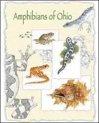

---
---

<link rel="stylesheet" href="styles.css" type="text/css">

# Publications

Below are my publications and PDF reprints, and here is a link to my [Google Scholar](https://scholar.google.com/citations?user=wYb92bAAAAAJ&hl=en&oi=ao). Carrots (^) indicate undergraduate students that I mentored.

### <u>Submitted/in review</u>

T Mitchell, **B Folt**, J Hall (submitted). <i>Agama</i> the Grouch: dumpsters are important habitat for invasive African rock agama lizards in Florida.

**B Folt**, C Guyer (in review). Habitat-dependent effects of predators on prey frogs in a Neotropical wet forest. 

AJ Lawson, **B Folt**, AM Tucker, F Erickson, CP McGowan (in review). Decision context as a necessary component of population viability analysis appraisal.

**B Folt**, J Goessling, AM Tucker, C Guyer, S Hermann, E Shelton-Nix, CP McGowan (in review). Contrasting patterns of demography and population viability among gopher tortoise populations in Alabama.

**B Folt** (accepted pending revision). Population demography of *Rhinoclemmys funerea* (Black River Turtle) at a protected forest reserve in Costa Rica.

### <u>2020</u>

R Etzel^, M Cornish^, MS Kifer^, L Nuñez, G Valladao^, **B Folt** (2020). Subterranean advertisement and duet calling behavior in *Ptychohyla legleri* (Legler’s Stream Frog). *Alytes* 37(3–4): 57–61. [Proofs](files/etzel-et-al-2020-proofs.pdf) [Data](https://figshare.com/articles/Calling_Behavior_of_Ptychohyla_legleri_Legler_s_Stream_Frog_/11797191)

**B Folt**, CP McGowan, DA Steen, S Piccolomini, M Hoffman, J Godwin, C Guyer (2019). Modeling strategies and evaluating success during repatriations of elusive and endangered species. *Animal Conservation*. [PDF](files/folt-et-al-2019-animal-conservation.pdf) [DOI](https://doi.org/10.1111/acv.12537) [Code](https://github.com/brianf0lt/indigo-repatriation-model)

### <u>2019</u>

C Guyer, **B Folt**, M Hoffman, J Bauder, D Stevenson, S Goetz, M Miller, J Godwin (2019). Patterns of head shape and scutellation in *Drymarchon couperi* (Squamata: Colubridae) reveal a single morphological species. *Zootaxa* 4695(2): 168–174. [PDF](files/guyer-et-al-2019-zootaxa.pdf) [DOI](http://dx.doi.org/10.11646/zootaxa.4695.2.6)

C Guyer, S Goetz, **B Folt**, K Joyce^ & M Hayes (2019). Variation in head shape and color of slimy salamanders (*Plethodon glutinosus* complex) across the Gulf Coastal Plain, USA. *Copeia* 107(4): 694–700. [PDF](files/guyer-et-al-2019-copeia.pdf) [DOI](https://doi.org/10.1643/CH-18-169)

**B Folt**, J Bauder, S Spear, D Stevenson, M Hoffman, J Oaks, PL Wood Jr, C Jenkins, D Steen, C Guyer (2019). Taxonomic and conservation implications of population genetic admixture, mito-nuclear discordance, and male-biased dispersal of a large endangered snake, *Drymarchon couperi*. *PLoS ONE* 14(3): e0214439. [PDF](https://journals.plos.org/plosone/article/file?type=printable&id=10.1371/journal.pone.0214439) [DOI](https://journals.plos.org/plosone/article?id=10.1371/journal.pone.0214439) [Data](https://figshare.com/articles/Taxonomic_and_conservation_implications_of_population_genetic_admixture_mito-nuclear_discordance_and_male-biased_dispersal_of_a_large_endangered_snake_Drymarchon_couperi/7637729) [Op-ed in the *Tallahassee Democrat*](https://www.tallahassee.com/story/opinion/2019/03/31/indigo-snake-releases-guided-strong-science-conservation-ethic/3313120002/)

R Hopkins^, **B Folt** (2019). Screaming calls of *Leptodactylus savagei* (Smoky Jungle Frog) function as an alarm for conspecifics. *Journal of Herpetology* 53(2): 154–157. [PDF](files/hopkins-folt-2019.pdf) [DOI](https://doi.org/10.1670/18-083) [Data](https://figshare.com/articles/Screaming_calls_of_Leptodactylus_savagei_Smoky_Jungle_Frog_function_as_an_alarm_for_conspecifics/7568972)

### <u>2018</u>

N Rivera^, **B Folt** (2018). Community assembly of glass frogs (Centrolenidae) in a Neotropical wet forest: a test of the river zonation hypothesis. *Journal of Tropical Ecology* 34: 108–120. [PDF](files/rivera-folt-2018-glassfrogs.pdf) [DOI](http://dx.doi.org/10.1017/S0266467418000068)

**B Folt**, MA Donnelly, C Guyer (2018). Spatial patterns of *Oophaga pumilio* in a homogeneous plantation system are consistent with conspecific attraction. *Ecology and Evolution* 8: 2880–2889. [PDF](https://onlinelibrary.wiley.com/doi/epdf/10.1002/ece3.3748) [DOI](http://onlinelibrary.wiley.com/doi/10.1002/ece3.3748/full)

### <u>2017</u>

**B Folt**, W Lapinski (2017). New observations of frog and lizard predation by wandering and orb-weaver spiders in Costa Rica. *Phyllomedusa* 16: 269–277. [PDF](files/folt-lapinski-2017.pdf) [DOI](http://dx.doi.org/10.11606/issn.2316-9079.v16i2p269-277)

JR Roberts, KM Halanych, CR Arias, **B Folt**, JM Goessling, SA Bullard (2017). Emendation and new species of *Hapalorhynchus* Stunkard, 1922 (Digenea: Schistosomatoidea) from musk turtles (Kinosternidae: *Sternotherus*) in Alabama and Florida rivers. *Parasitology International* 66: 748–760. [PDF](files/roberts-et-al-2017-parasitology-international.pdf) [DOI](http://www.sciencedirect.com/science/article/pii/S1383576917302222)

### <u>2016</u>

**B Folt**, JB Jensen, A Teare, D Rostal (2016). Establishing reference demography for conservation: A case study of *Macrochelys temminckii* in Spring Creek, Georgia. *Herpetological Monographs* 30: 21–33. [PDF](files/folt-et-al-2016-macrochelys.pdf)  [DOI](http://dx.doi.org/10.1655/HerpMonographs-D-15-00004)

**B Folt**, N Garrison, C Guyer, J Rodriguez, JE Bond (2016). Phylogeography and evolution of the Red Salamander (*Pseudotriton ruber*). *Molecular Phylogenetics and Evolution* 98: 97–110. [PDF](files/folt-et-al-2016-mpe.pdf)  [DOI](http://dx.doi.org/10.1016/j.ympev.2016.01.016)

JR Ennen, J Godwin, JE Lovich, BR Kreiser, **B Folt**, S Hazzard (2016). Interdrainage morphological and genetic differences in the Escambia Map Turtle, *Graptemys ernsti*. *Herpetological Conservation and Biology* 11(1): 122–131. [PDF/DOI](http://www.herpconbio.org/Volume_11/Issue_1/Ennen_etal_2016.pdf)

### <u>2015</u>

**B Folt**, C Guyer (2015). Evaluating recent taxonomic changes for alligator snapping turtles (Testudines: Chelydridae). *Zootaxa* 3947(3): 447–450. [PDF](files/folt-guyer-2015.pdf)  [DOI](http://dx.doi.org/10.11646/zootaxa.3947.3.11)

### <u>2014</u>

JC Godwin, JE Lovich, JR Ennen, B Kreiser, **B Folt**, C Lechowicz (2014). Hybridization of two megacephalic map turtles (Testudines: Emydidae: *Graptemys*) in the Choctawhatchee River drainage of Alabama and Florida. *Copeia* 2014(4): 725–742. [PDF](files/godwin-et-al-2014-graptemys.pdf)  [DOI](http://dx.doi.org/10.1643/CH-13-132)

### <u>2013</u>

**B Folt**, JC Godwin (2013). Status of the Alligator Snapping Turtle (*Macrochelys temminckii*) in south Alabama with comments on its distribution. *Chelonian Conservation and Biology* 12(2): 211–217. [PDF](files/folt-godwin-2013-macrochelys.pdf)  [DOI](http://dx.doi.org/10.2744/CCB-1036.1)

**B Folt**, KE Reider (2013). Leaf-litter herpetofaunal richness, abundance, and community assembly in mono-dominant plantations and primary forest of northeastern Costa Rica. *Biodiversity and Conservation* 22(9): 2057–2070. [PDF](files/folt-reider-2013.pdf)  [DOI](http://dx.doi.org/10.1007/s10531-013-0526-0)

### <u>Book chapters</u>

**B Folt** (in press). Eastern Fence Lizard *Sceloporus undulatus* (Bosc & Daudin 1801). In: D Wynn et al. (eds). *Reptiles of Ohio*. Forthcoming.

**B Folt**, JG Davis (2013). Blanchard’s Cricket Frog *Acris blanchardi* (Harper 1947). In: R Pfingsten, JG Davis, TO Matson, G Lipps Jr., D Wynn, BJ Armitage (eds) *Amphibians of Ohio*. Ohio Biological Survey Bulletin New Series 17(1)
 
 
### <u>Natural history papers</u>

C Sanspree, CM Murray, **B Folt** (2016). *Macrochelys temminckii* (Alligator Snapping Turtle): predation. *Herpetological Review* 47(1): 124–5. [PDF](files/sanspree-et-al-2016-macrochelys-predation.pdf) 

**B Folt**, D Laurencio, JM Goessling, RD Birkhead, J Stiles, S Stiles, S Belford, AT Harris (2015). One hundred two new county records for amphibians and reptiles in Alabama. *Herpetological Review* 46(4): 591–594. [PDF](files/folt-et-al-2015-102-al-records.pdf) 

C Ganong, **B Folt** (2015). *Pristimantis cerasinus* (Clay-colored Rain Frog): mortality. *Herpetological Review* 46(3): 416.

TW Pierson^, T Stratmann, EC White, AG Clause, C Carter, MW Herr, AJ Jenkins, H Vogel, M Knoerr, **B Folt** (2014). New county records of amphibians and reptiles resulting from a bioblitz competition in north-central Georgia, USA. *Herpetological Review* 45(2): 296–297. [PDF](files/pierson-et-al-2014-ga-bioblitz.pdf) 

SC Sterrett, JB Jensen, **B Folt** (2014). *Graptemys barbouri* (Barbour’s Map Turtle): basking height. *Herpetological Review* 45(2): 314–31

**B Folt**, T Pierson^, SM Goetz, J Goessling, D Laurencio, D Thompson^, SP Graham (2013). Amphibians and reptiles of Jasper County, Mississippi with comments on the potentially extinct Bay Springs Salamander (*Plethodon ainsworthi*). *Herpetological Review* 44(2): 283–286. [PDF](files/folt-et-al-2013-ms-bioblitz.pdf) 

**B Folt**, D Laurencio (2013). *Agkistrodon contortrix* (Copperhead): diet. *Herpetological Review* 44(3): 517.

**B Folt**, JR Folt, CR Brune (2012). New county records for Ohio amphibians and reptiles. *Herpetological Review* 43(4): 624–625.

### <u>Geographic distribution notes</u>

R Birkhead, **B Folt**, C Guyer (2017). *Nerodia rhombifer* (Diamond-backed Watersnake): geographic distribution. *Herpetological Review* 48(4).

R Birkhead, **B Folt**, C Guyer (2017). *Acris crepitans* (Eastern Cricket Frog): geographic distribution. *Herpetological Review* 48(4)

J Roberts, **B Folt**, JB Jensen (2016). *Pseudemys concinna* (River Cooter): geographic distribution. *Herpetological Review* 47(4): 626.

**B Folt** (2013). *Hemidactylium scutatum* (Four-toed Salamander): geographic distribution. *Herpetological Review* 44(2): 269.

IEP Turner, **B Folt** (2012). *Terrapene carolina* (Eastern Box Turtle): geographic distribution. *Herpetological Review* 43(4): 617.

**B Folt** (2012). *Lithobates heckscheri* (River Frog): geographic distribution. *Herpetological Review* 43(1): 99.

**B Folt** (2012). *Sternotherus odoratus* (Eastern Musk Turtle): geographic distribution. *Herpetological Review* 43(1): 100.

**B Folt** (2012). *Plestiodon laticeps* (Broad-headed Skink): geographic distribution. *Herpetological Review* 43(1): 103.

**B Folt** (2012). *Virginia valeriae* (Smooth Earthsnake): geographic distribution. *Herpetological Review* 43(1): 109.
