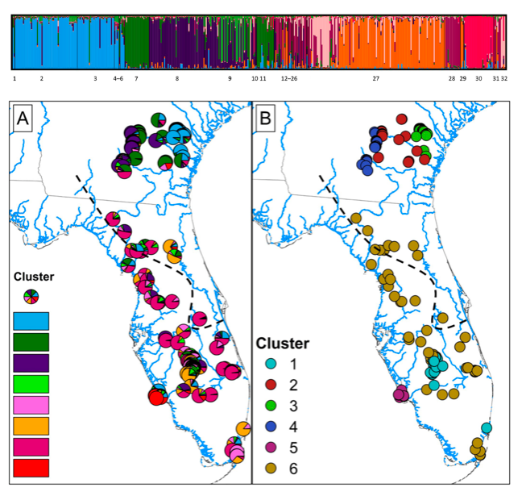

---
---

<link rel="stylesheet" href="styles.css" type="text/css">

# Research 

My research program synthesizes topics from three different research fields – ecology, evolution, and wildlife management. Simply put, I develop and test hypotheses about the way nature works, and then I apply these models in ways to sustainably conserve both organisms and ecosystems. **Click on the headers** below  to learn more about areas of my research and see examples of research products. I also include links to more detailed descriptions on my [ResearchGate](https://www.researchgate.net/profile/Brian_Folt) profile. Also, check out my [fieldwork](https://brianfolt.github.io/fieldwork) page for a map of study sites, pictures, and videos from fun field trips.

## 1) Applied population ecology

I perform demographic studies of imperiled vertebrates that are currently listed or being petitioned for listing under the federal Endangered Species Act (ESA). To do so, I use field studies to understand the intrinsic and extrinsic factors influencing demographic vital rates of species, and then I build mathematical population models that evaluate how management plans influence population growth. This research seeks to support strong decision-making processes to conserve imperiled species. [Project description](https://www.researchgate.net/project/Applied-population-modeling-of-imperiled-vertebrates)

  - [Modeling reintroduction scenarios and successes for the federally-threatened Eastern Indigo Snakes](files/folt-et-al-2019-animal-conservation.pdf) (<i>Drymarchon couperi</i>)
  
  - [Population demographics of Alligator Snapping Turtles](files/folt-et-al-2016-macrochelys.pdf) (<i>Macrochelys temminckii</i>) in an unharvested reference population
  
  - Estimating demography and projecting population viability of Gopher Tortoises (<i>Gopherus polyphemus</i>) (in review)
  
  - The importance of decision context in population viability analysis (in preparation)

## 2) Population regulation

In general, I am interested in understanding the intrinsic and extrinsic factors that influence population growth and regulation of animals. For my dissertation, I tested and integrated three hypotheses describing bottom-up (food resources), top-down (predators), and parallel (intraspecific interactions) population regulation of a model frog and lizard assemblage at La Selva Biological Station, Costa Rica. [Project description](https://www.researchgate.net/project/Population-and-community-ecology-in-Neotropical-forests)

  - [Conspecific attraction of poison frogs](https://onlinelibrary.wiley.com/doi/epdf/10.1002/ece3.3748) in tropical forests  
  
  - Top-down vs. bottom-up regulation of prey frogs and lizards (mainland-island model of anole population regulation) (in review)
  
  - Bottom-up regulation of frogs and lizards (the litter-mosaic hypothesis; in revision)
  
  - [Habitat-driven community assembly of glassfrogs](files/rivera-folt-2018-glassfrogs.pdf)

## 3) Molecular ecology

Habitat fragmentation in the Anthropocene has drastically reshaped natural landscapes and greatly disrupted patterns of gene flow among plant and animal populations, particularly for ‘rare’ species with low dispersal ability. However, when species decline and become at risk of extinction, populations become less abundant and typical methods to assess demographic features (e.g., mark-recapture) can become impractical for estimating trends in population vital rates. To this end, I use a molecular ecology toolkit to assess demography features for imperiled species, such as population redundancy (i.e., the number of populations), effective population size, genetic diversity, migration between populations, and phylogenetic structure – and I leverage this information to guide conservation strong decision making. [Project description](https://www.researchgate.net/project/Evolution-and-systematics-of-amphibians-and-reptiles)

  - [Population genetic structure of Eastern Indigo Snakes](files/folt-et-al-2019-plos-one.pdf) (<i>Drymarchon couperi</i>)
  
  - Hybridization of Map Turtles (<i>Graptemys</i> sps.) [PDF1](files/godwin-et-al-2014-graptemys.pdf) [PDF2](http://www.herpconbio.org/Volume_11/Issue_1/Ennen_etal_2016.pdf)
  
  - [Phylogenomics of plethodontid salamanders](files/folt-et-al-2016-mpe.pdf)
  
  - [Systematics of Alligator Snapping Turtles](files/folt-guyer-2015.pdf) (<i>Macrochelys</i> sp.)

  
  