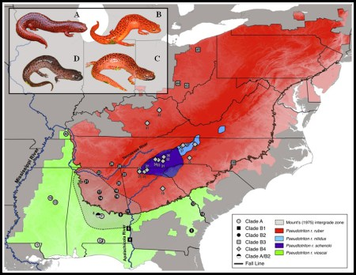

---
---

<link rel="stylesheet" href="styles.css" type="text/css">

# Research 

My research program synthesizes topics from three different research fields – ecology, evolution, and wildlife management. Simply put, I develop and test hypotheses about the way nature works, and then I apply these models in ways to sustainably conserve both organisms and ecosystems. **Click on the headers** below  to learn more about areas of my research; I also include links to more detailed descriptions on my [ResearchGate](https://www.researchgate.net/profile/Brian_Folt) profile and to resulting publications! Also, check out my [fieldwork](https://brianfolt.github.io/fieldwork) page for a map of study sites, pictures, and videos from fun field trips.

## 1) Quantitative population ecology and conservation of imperiled species

I have engaged in demographic studies of large and imperiled reptiles that are currently listed or being petitioned for listing under the federal Endangered Species Act (ESA). These studies use field studies to understand the factors influencing demographic processes within species, and mathematical modeling processes to make smart decisions for how to conserve them. [Project description](https://www.researchgate.net/project/Applied-population-modeling-of-imperiled-vertebrates)

  - Modeling reintroduction scenarios and successes for the federally-threatened Eastern Indigo Snakes (<i>Drymarchon couperi</i>) in Alabama and Florida [PDF](files/folt-et-al-2019-animal-conservation.PDF)
  
  - Population demographics of Alligator Snapping Turtles (<i>Macrochelys temminckii</i>) [PDF](files/folt-et-al-2016-macrochelys.PDF) 
  
  - Estimating demography and projecting population viability of Gopher Tortoises (<i>Gopherus polyphemus</i>) (in review)

## 2) Population ecology in Neotropical rain forests

For my dissertation, I tested and integrated three hypotheses describing bottom-up, top-down, and parallel population regulation of a model frog and lizard assemblage at La Selva Biological Station, Costa Rica. [Project description](https://www.researchgate.net/project/Population-and-community-ecology-in-Neotropical-forests)

  - Top-down vs. bottom-up regulation of prey frogs and lizards (mainland-island model of anole population regulation) (in review)
  
  - Conspecific attraction of [poison frogs](https://onlinelibrary.wiley.com/doi/epdf/10.1002/ece3.3748) in tropical forests
  
  - Bottom-up regulation of frogs and lizards (the litter-mosaic hypothesis)
  
  - Habitat-driven [community assembly of glassfrogs](files/rivera-folt-2018-glassfrogs.PDF)

## 3) Molecular ecology and systematics

I am also active in projects which use a molecular-ecology toolkit to test hypotheses about population genetic structure, historical biogeography, and systematic relationships among vertebrates — while keeping a keen interest in how these patterns and processes influence conservation strategies. [Project description](https://www.researchgate.net/project/Evolution-and-systematics-of-amphibians-and-reptiles)

  - Population [genetic structure of Eastern Indigo Snakes](files/folt-et-al-2019-plos-one.PDF) (<i>Drymarchon couperi</i>)
  
  - Hybridization of Map Turtles (<i>Graptemys</i> sps.) [PDF1](files/godwin-et-al-2014-graptemys.PDF) [PDF2](http://www.herpconbio.org/Volume_11/Issue_1/Ennen_etal_2016.pdf)
  
  - Phylogenomics of plethodontid salamanders [PDF](files/folt-et-al-2016-mpe.PDF)
  
  - Systematics of Alligator Snapping Turtles (<i>Macrochelys</i> sp.) [PDF](files/folt-guyer-2015.PDF)

  
  